# TUGAS 7

# Disusun Oleh

| NAMA | NRP |
| ---- | --- |
| Denti Widayati | 3122500003 | 

**DAFTAR ISI**

1. [Getting started](#1-getting-started) 
2. [Our Application ](#2-our-application)
3. [Updating our App](#3-updating-our-app)
4. [Sharing our app](#4-sharing-our-apps)
5. [Persisting our db](#5-persisting-our-db)
6. [Using bind mound](#6-using-bind-mounts)
7. [Multi container app](#7-multi-container-app)
8. [Using Docker Compose](#8-using-docker-compose)
9. [Image Building best practice](#9-image-building-best-practices)

# 1. Getting Started


Kode ini akan menjalankan container dari image dockersamples/101-tutorial dalam mode terpisah (detached), dan memetakan port 80 pada host ke port 80 di dalam container. Ini biasanya digunakan untuk menjalankan aplikasi web atau layanan lain yang mendengarkan pada port 80, sehingga bisa diakses melalui http://localhost atau http://<host-ip> pada browser web Anda.

```
docker run -d -p 80:80 dockersamples/101-tutorial\
```
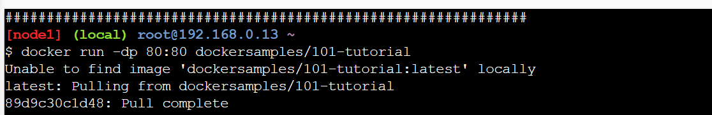

# 2. Our Application

Kita akan bekerja dengan pengelola daftar tugas sederhana yang berjalan di Node. Jika Anda tidak terbiasa dengan Node, jangan khawatir! Anda tidak memerlukan pengalaman JavaScript yang mendalam!

Pada titik ini akan membangun sebuah aplikasi untuk membuktikan MVP (minimum viable product). Anda ingin menunjukkan cara kerjanya dan apa yang bisa dilakukan tanpa perlu memikirkan bagaimana cara kerjanya untuk tim besar

1.Download zip di link berikut dapat diperoleh pada link berikut : [Download ZIP](http://ip172-18-0-50-cp4obtiim2rg009r0egg-80.direct.labs.play-with-docker.com/assets/app.zip)

Setelah di download Drag file zip tersebut kedalam terminal lab docker. lakukan unzip file dan buat file Dockerfile
```
unzip app.zip
cd app
touch Dockerfile
vi Dockerfile
```

2.Didalam terminal docker, drag dan drop file
```
unzip app.zip
```

3.Ubah direktori ke folder 'app' yang baru.
```
cd app/
```

4.Di direktori ini, Anda akan melihat aplikasi sederhana berbasis Node.
```
ls
package.json  spec          src           yarn.lock
```

## 2.1 Building the App's Container Image

1.Buat terlebih dahulu Dockerfile dan didalamnya ketiklah konfigurasi basic berikut:

```
FROM node:10-alpine
WORKDIR /app
COPY . .
RUN yarn install --production
CMD ["node", "/app/src/index.js"]
```
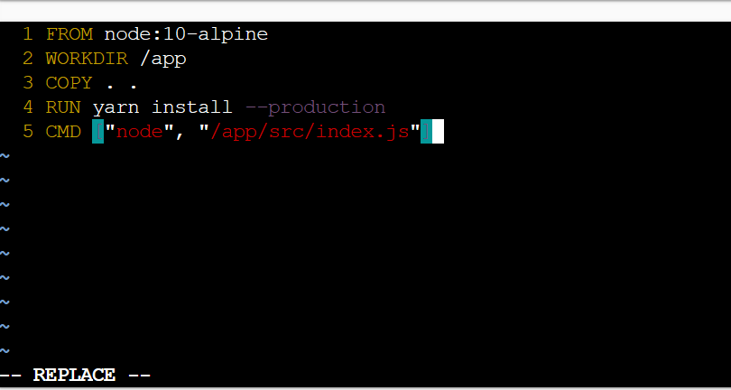

Penjelasan

**FROM node:10-alpine**: Menggunakan image dasar Node.js versi 10 berbasis Alpine Linux, yang ringan.

**WORKDIR /app**: Menetapkan direktori kerja dalam container ke /app.

**COPY . .**: Menyalin semua file dari direktori proyek di host ke direktori kerja (/app) di dalam container.

**RUN yarn install --production**: Menjalankan perintah untuk menginstal dependensi proyek menggunakan Yarn, hanya untuk produksi.

**CMD ["node", "/app/src/index.js"]**: Menentukan perintah yang akan dijalankan ketika container dimulai, yaitu menjalankan aplikasi Node.js dari file index.js di direktori src.

2.Lakukan Build Images


**-t docker-101**: Menetapkan tag (nama) untuk image yang dibangun, dalam hal ini docker-101.
**.**: Menunjukkan bahwa Dockerfile dan konteks build berada di direktori saat ini.


## 2.2 Starting an App Container¶

1.Mulai container dengan perintah:

```
docker run -dp 3000:3000 docker-101
```
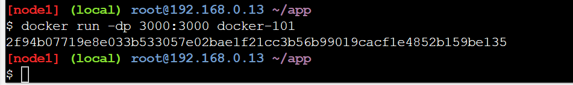

2.Buka aplikasinya dengan mengklik badge "3000" di bagian atas antarmuka PWD. Setelah terbuka, web akan memiliki daftar tugas kosong!

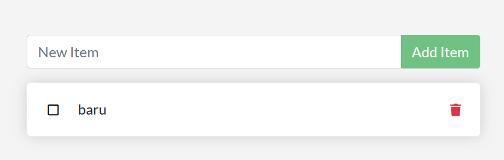


# 3. Updating our App


## 3.1 Updating our Source Code

Disini kita akan mencoba mengedit source file dari App kita yang sudah dijalankan pada Container, contoh disini kita ubah pada file app.js

1.Buka /app/src/static/js/app.js gunakan editor dari labs

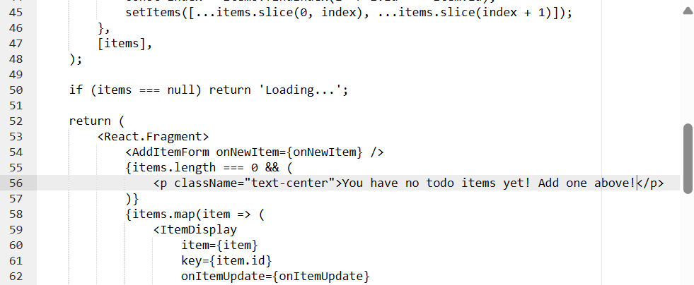

2.Build ulang Images karena kita melakukan perubahan pada source

```
docker build -t docker-101 .
```
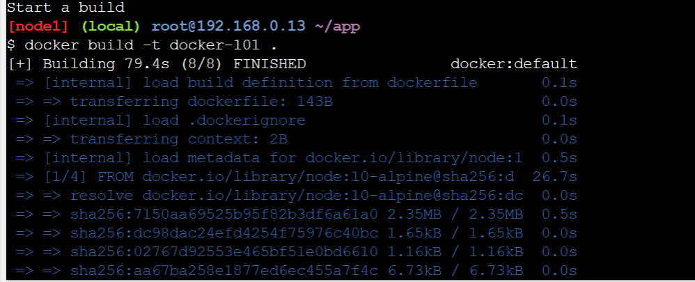


3.Jalankan Images Lagi ( Terdapat error karena terdapat instance dengan port yang sama berjalan)

```
docker run -dp 3000:3000 docker-101
```
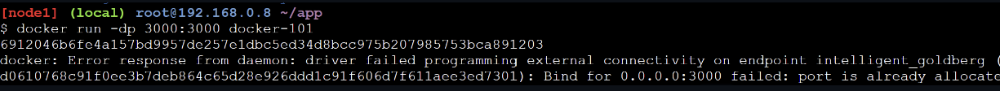


## 3.2 Replacing our Old Container
Untuk menghapus sebuah container, container tersebut harus dihentikan terlebih dahulu. Setelah itu, baru container dapat dihapus.

1.Dapatkan ID container dengan **docker ps**.
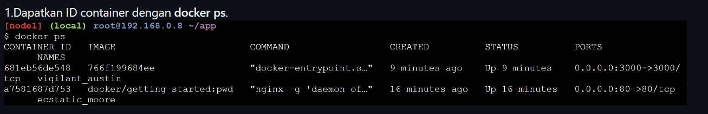

2.Gunakan command docker stop untuk memberhentikan container dengan port yg sama

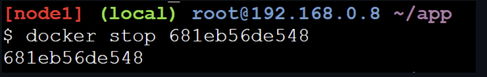


3.Setelah container berhenti, kita dapat menghapus dgn command **docker rm (the-container-id)**
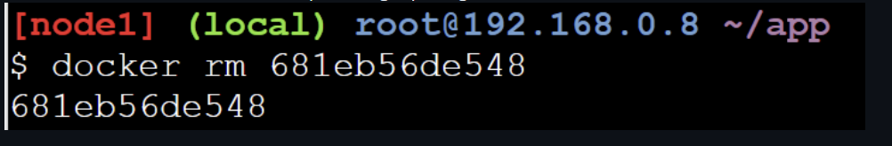

4.Start kembali app yang baru

```
docker run -dp 3000:3000 docker-101
```
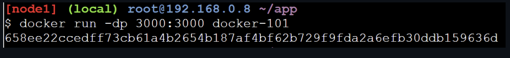


Sudah berubah


# 4. Sharing Our Apps

1.Seperti github Docker memiliki Repositorynya sendiri seperti pada step pertama dilakukan pulling dari Docker Repo yang bernama Hub Docker https://hub.docker.com/

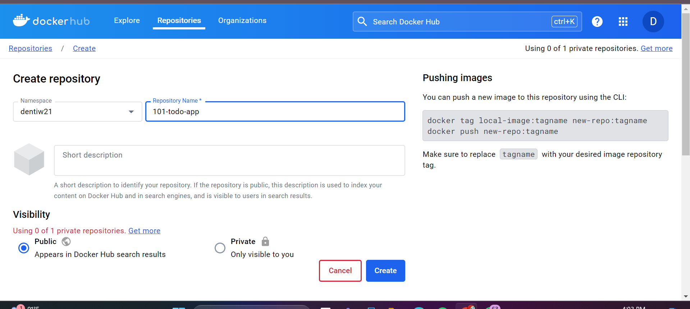

# 4.1 Pushing our Image

1.Push images dari Local ke dalam Docker HUB
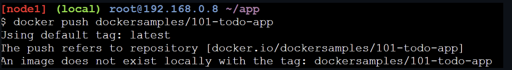


2.Terjadi Error, Untuk memperbaiki ini, kita perlu "tag" gambar kita, yang pada dasarnya berarti memberinya nama lain.
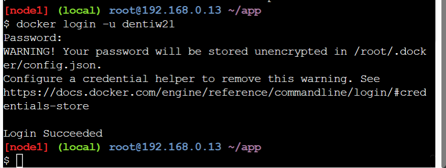

3.Kita tag images tersebut ke dentiw21/101-todo-app


4.Push tagged images

```
docker push dentiw21/101-todo-app
```


5.Berhasil !!!


# 4.2 Running our Image on a New Instance

Coba menjalankan aplikasi kita pada instans baru yang belum pernah melihat container ini sebelumnya!

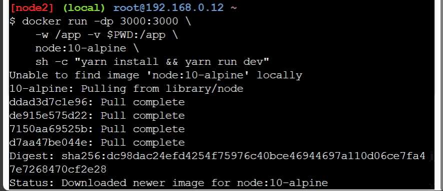

# 5. Persisting our DB

## 5.1 The Container's Filesystem

Kita tahu bahwa saat kita menghentikan/menghapus container data yang tersimpan pada container akan ikut hilang nah disini kita akan melakukan presisting data

Kita buat 2 container

Container Pertama

1.Buat sebuah Container dengan OS ubuntu dan buat sebuah file bernama file.txt yang melakukan generate random angka dari 1 hingga 10000

```
docker run -d ubuntu bash -c "shuf -i 1-10000 -n 1 -o /data.txt && tail -f /dev/null"
```
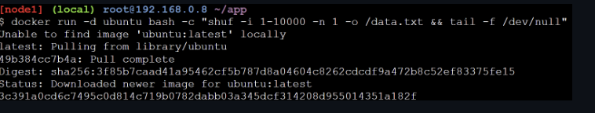

2.Validasi bahwa kita dapat melihat output dengan masuk ke dalam container. Untuk melakukannya, Anda perlu mendapatkan ID container (gunakan docker ps untuk mendapatkannya).

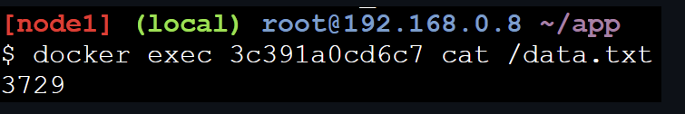

3.Mulai container ubuntu lain (dengan gambar yang sama) dan kita akan lihat bahwa kita tidak memiliki file yang sama.   

```
docker run -it ubuntu ls /
```
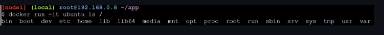

## 5.2 Persisting our Todo Data

Secara default todo-app menyimpan pada sqlite database

kita lakukn mounting database ke app dengan membuat sebuah volume

1.Buat volume dengan **docker volume create**.
```
docker volume create todo-db
```
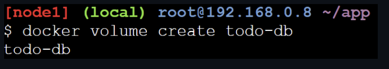

2.Start todo container

```
docker run -dp 3000:3000 -v todo-db:/etc/todos docker-101
```

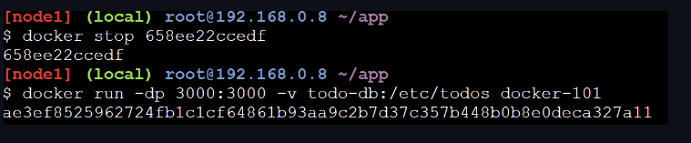

3.tambahakan beberapa data seblum di hapus container
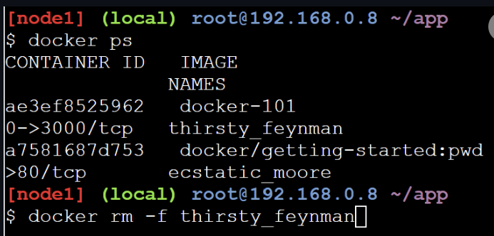

4.Remove container


5.Start lagi! dan seharusnya data masih ada


6.docker menyimpannya dalam sebuah directory

```
docker volume inspect todo-db
[
    {
        "CreatedAt": "2019-09-26T02:18:36Z",
        "Driver": "local",
        "Labels": {},
        "Mountpoint": "/var/lib/docker/volumes/todo-db/_data",
        "Name": "todo-db",
        "Options": {},
        "Scope": "local"
    }
]
```

# 6. Using Bind Mounts

presist data dapat disimpan kedalam volume, tetapi pada kasus tertentu kita harus tahu dimana letak dari data yang kita simpan, dengan Bind Mounts kita bisa mengatur letak dari data yang disimpan.

## 6.1. Starting a Dev-Mode Container

1.Hentikan semua docker-101 yang berjalan
2.Run the following command. We'll explain what's going on afterwards:


3.Lihat apa yang terjadi didalam container dengan melihat logs nya


4.Buat perubahan pada aplikasi. Dalam file src/static/js/app.js, ubah tombol "Add Item" menjadi "Add". Perubahan ini akan ada di baris 109.


5.Refresh page dan akan melihat perubahan tersebut tercermin di browser hampir seketika. Mungkin perlu beberapa detik bagi server Node untuk memulai ulang, jadi jika Anda mendapatkan error, coba segarkan kembali setelah beberapa detik.


# 7. Multi Container App
Sampai saat ini, kita telah bekerja dengan aplikasi satu container. Namun, sekarang kita ingin menambahkan MySQL ke dalam stack aplikasi. Pertanyaan berikut sering muncul - "Di mana MySQL akan dijalankan? Install di container yang sama atau jalankan secara terpisah?" Secara umum, setiap container sebaiknya melakukan satu tugas dan melakukannya dengan baik. 

## 7.1 Starting MySQL

1.Buat Network

```
docker network create todo-app
```


2.Mulai sebuah container MySQL dan tambahkan ke jaringan. Kita juga akan mendefinisikan beberapa variabel lingkungan yang akan digunakan oleh database untuk menginisialisasi database (lihat bagian "Environment Variables" di listing MySQL di Docker Hub).

```
 docker run -d \
     --network todo-app --network-alias mysql \
     -v todo-mysql-data:/var/lib/mysql \
     -e MYSQL_ROOT_PASSWORD=secret \
     -e MYSQL_DATABASE=todos \
     mysql:5.7
```


3.Mari kita coba mysql didalam containernya
```
docker exec -it <mysql-container-id> mysql -p
```

## 7.2 Connecting to MySQL

1.Mulai container baru menggunakan gambar nicolaka/netshoot. Pastikan untuk menghubungkannya ke jaringan yang sama.


2.Di dalam container, kita akan menggunakan perintah dig, yang merupakan alat DNS yang berguna. Kita akan mencari alamat IP untuk hostname mysql.

```
; <<>> DiG 9.14.1 <<>> mysql
;; global options: +cmd
;; Got answer:
;; ->>HEADER<<- opcode: QUERY, status: NOERROR, id: 32162
;; flags: qr rd ra; QUERY: 1, ANSWER: 1, AUTHORITY: 0, ADDITIONAL: 0

;; QUESTION SECTION:
;mysql.             IN  A

;; ANSWER SECTION:
mysql.          600 IN  A   172.23.0.2

;; Query time: 0 msec
;; SERVER: 127.0.0.11#53(127.0.0.11)
;; WHEN: Tue Oct 01 23:47:24 UTC 2019
;; MSG SIZE  rcvd: 44
```


## 7.3 Running our App with MySQL

1.Run dengan command berikut tidak perlu ip spesifik

```
 docker run -dp 3000:3000 \
 -w /app -v $PWD:/app \
 --network todo-app \
 -e MYSQL_HOST=mysql \
 -e MYSQL_USER=root \
 -e MYSQL_PASSWORD=secret \
 -e MYSQL_DB=todos \
 node:10-alpine \
 sh -c "yarn install && yarn run dev"
 ```


2.cek log apakah berhasil dijalankan


3.Open the app in your browser and add a few items to your todo list.


4.Coba konek ke mysql database


# 8. Using Docker Compose

## 8.1 Installing Docker Compose

1.Cek compose versi

```
 docker-compose version
 ```


# 8.2 Creating our Compose File

mendefinisikan layanan baru dan menamainya mysql agar secara otomatis mendapatkan alias jaringan. Kita juga akan menentukan gambar yang akan digunakan.

```
version: "3.7"

services:
  app:
    # The app service definition
  mysql:
    image: mysql:5.7
```


## 8.3  Defining the App Service
this was the command we were using to define our app container

```
docker run -dp 3000:3000 \
  -w /app -v $PWD:/app \
  --network todo-app \
  -e MYSQL_HOST=mysql \
  -e MYSQL_USER=root \
  -e MYSQL_PASSWORD=secret \
  -e MYSQL_DB=todos \
  node:10-alpine \
  sh -c "yarn install && yarn run dev"
```


## 8.4  Defining the MySQL Service

```
docker run -d \
  --network todo-app --network-alias mysql \
  -v todo-mysql-data:/var/lib/mysql \
  -e MYSQL_ROOT_PASSWORD=secret \
  -e MYSQL_DATABASE=todos \
  mysql:5.7
```


## 8.5 Running our Application Stack

1.Pastikan tidak ada salinan lain dari aplikasi/database yang sedang berjalan terlebih dahulu (gunakan docker ps dan docker rm -f).

2.Jalankan stack aplikasi menggunakan perintah docker-compose up. Kita akan menambahkan flag -d untuk menjalankan semuanya di latar belakang.
```
docker-compose up -d
```


3.Lihat log menggunakan perintah docker-compose logs -f. Anda akan melihat log dari setiap layanan digabungkan menjadi satu aliran. Ini sangat berguna ketika Anda ingin memantau masalah yang terkait dengan waktu. Flag -f "mengikuti" log, sehingga akan memberikan output langsung saat log dihasilkan.


# 9. Image Building Best Practices

## 9.1 Image Layering

1.Gunakan perintah docker image history untuk melihat lapisan-lapisan dalam gambar docker-101 yang Anda buat sebelumnya dalam tutorial.

```
docker image history
```


2.Anda akan melihat bahwa beberapa baris terpotong. Jika Anda menambahkan flag --no-trunc, Anda akan mendapatkan output lengkap (ya... lucu bagaimana Anda menggunakan flag yang berarti "terpotong" untuk mendapatkan output yang tidak terpotong, ya?)

```
docker image history --no-trunc docker-101
```


## 9.2 Layer Caching

1.Perbarui Dockerfile untuk menyalin package.json terlebih dahulu, menginstal dependensi, dan kemudian menyalin semua yang lainnya.

```
FROM node:10-alpine
WORKDIR /app
COPY package.json yarn.lock ./
RUN yarn install --production
COPY . .
CMD ["node", "/app/src/index.js"]
```


2.Build a new image using docker build.

```
docker build -t docker-101 .
```


3.Sekarang, buat perubahan pada file src/static/index.html (misalnya, ubah <title> menjadi "The Awesome Todo App").


4.Bangun ulang image Docker menggunakan perintah docker build lagi. Kali ini, output Anda seharusnya terlihat sedikit berbeda.


## 9.3 Multi-Stage Builds

Pisahkan dependensi waktu build dari dependensi waktu proses Kurangi ukuran Image secara keseluruhan dengan hanya mengirimkan apa yang diperlukan aplikasi Anda untuk berjalan

Maven/Tomcat Example
```
    FROM maven AS build
    WORKDIR /app
    COPY . .
    RUN mvn package

    FROM tomcat
    COPY --from=build /app/target/file.war /usr/local/tomcat/webapps 
```

React
```
    FROM node:10 AS build
    WORKDIR /app
    COPY package* yarn.lock ./
    RUN yarn install
    COPY public ./public
    COPY src ./src
    RUN yarn run build

    FROM nginx:alpine
    COPY --from=build /app/build /usr/share/nginx/html
```
