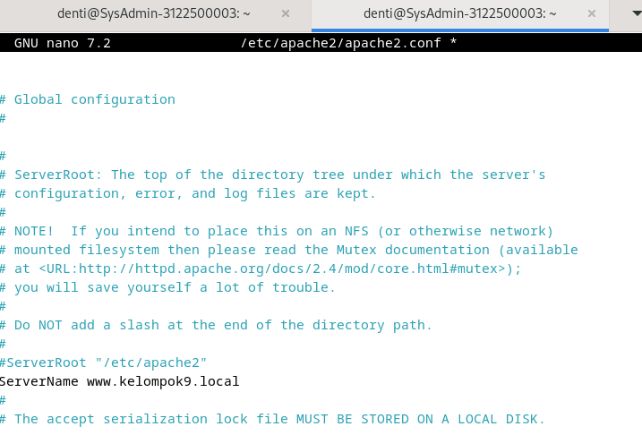
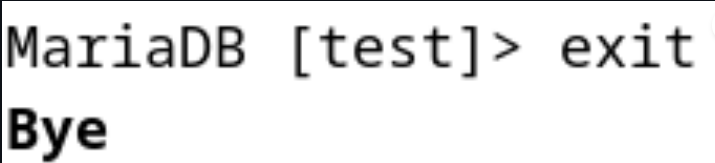
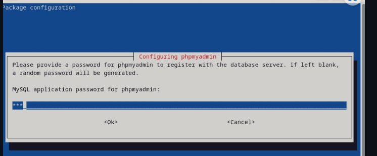

<div align="center">
  <h1>Tugas 4 </h1>
 <h2>  Workshop Administrasi Jaringan</h2>
<strong>konfigurasi Bind9 </strong>


<br><br>

<p>Oleh:</p>
<li>Denti Widayati (3122500003)</li>


<br>

<p>  Dosen Pembimbing     :  Dr. Ferry Astika Saputra ST, M.Sc</p>

<br>
PROGRAM STUDI D3 TEKNIK INFORMATIKA
POLITEKNIK ELEKTRONIKA NEGERI 
SURABAYA
2023 / 2024


</div>


<br><br><br><br><br><br>


<div>


<h2>KONFIGURASI NTP SERVER</h2>

<h3>1. Install NTP (Network Time Protocol)</h3>
<p>menggunakan perintah : 
<b>sudo apt-get install systemd-timesyncd</b>


<h3>2. Konfigurasi NTP ke timezone lokal (Asia/Jakarta)</h3>
<p> sudo timedatectl set-timezone Asia/Jakarta


<h3>3.Konfigurasi RTC (Real Time Clock) ke timezone lokal (Asia/Jakarta) dan mengaktifkan RTC</h3>


<h3>4.Konfigurasi NTP ke server terdeka</h3>
<b>sudo nano /etc/systemd/timesyncd.conf ubah bagian NTP= menjadi NTP=0.id.pool.ntp.org</b>


<p></p>

<h3>5.Restart NTP dan cek status NTP</h3>
<p>sudo systemctl restart systemd-timesyncd</p>
<p>sudo systemctl status systemd-timesyncd</p>


<h3>6. Lakukan pengecekan waktu</h3>
<p>bash timedatectl</p> 


<h2>Konfigurasi Web Server (apache2) dan PHP fpm</h2>


<h3>1. Install apache2 dan php-fpm</h3>
sudo apt-get install apache2 -y


<h3>2. Konfigurasi apache2</h3>

<p>Lakukan konfigurasi security apache2

sudo nano /etc/apache2/conf-enabled/security.conf

Ubah bagian ServerTokens menjadi Prod</p>


<h3>3.Lakukan konfigurasi directory apache2</h3>

<b>sudo nano /etc/apache2/mods-enabled/dir.com</b>


<h3>4.Tambahkan virtual host yang sudah disiapkan berdasarkan Canonical Name (CNAME) yang sudah dibuat (kelompok9.local) </h3>
<p>menggunakan perintah : sudo nano /etc/apache2/apache2.conf




<h3>5. Ubah Kontak email admin menjadi email webmaster@kelompok9.local</h3>
<p>menggunakan perintah</p>
<b>sudo nano /etc/apache2/sites-available/000-default.conf</b>
<p>Ubah bagian webmaster@localhost menjadi webmaster@kelompok9.local</p>


<h3>6.Restart apache2 dan cek status apache2 </h3>
<p>sudo systemctl restart apache2 sudo systemctl status apach</p>


<h3>7.  Lakukan Pengujian di browser</h3>
<p>menggunakan perintah : 
<b>Buka browser dan ketikkan alamat www.kelompok9.local</b>


<h3>8. Install PHP dan extensi mbstring serta lakukan pengujian</h3>
<p>menggunakan perintah : 
<b>Fungsi mbstring digunakan untuk memanipulasi string atau text non ASCII sudo apt -y install php8.2 php8.2-mbstring php-pear php -v</b>


Buat file php_info.php di /var/www/html sudo nano /var/www/html/php_info.php

Isi file php_info.php dengan kode berikut <?php phpinfo(); ?>

Buka browser dan ketikkan alamat www.kelompok9.local/php_info.php


<h3>9. Install PHP-FPM</h3>
<p>Php fpm adalah FastCGI Process Manager untuk PHP berfungsi sebagai server untuk PHP sudo apt -y install php-fpm </p>


<h3>10. Konfigurasi PHP-FPM di apache2</h3>
<p>menggunakan perintah : 
<b>sudo systemctl restart named</b>
nano /etc/apache2/sites-available/default-ssl.conf Berfungsi untuk mengarahkan apache2 ke php-fpm tambahkan di dalam tag VirtualHost *:443> VirtualHost


<p>a2enmod proxy_fcgi setenvif Ini berfungsi untuk mengaktifkan modul proxy_fcgi dan setenvif</p>
<p>a2enconf php8.2-fpm Ini berfungsi untuk mengaktifkan konfigurasi php8.2-fpm</p>
<p>systemctl restart php8.2-fpm apache2 Ini berfungsi untuk merestart php8.2-fpm dan apache2</p>


<h2>Konfigurasi Database Server (MariaDB)</h2>


<h3>1. Install MariaDB</h3>
<p>menggunakan perintah : 
<b>sudo apt -y install mariadb-server</b>


<h3>2. Konfigurasi MariaDB</h3>
<p>menggunakan perintah : 
<b>sudo /etc/mysql/mariadb.conf.d/50-server.cnf ubah line 95 menjadi

character-set-server = utf8mb4
collation-server = utf8mb4_general_ci</b>


sudo systemctl restart mariadb


<h3>3. Inisial Konfigurasi dan testing database MariaDB Server</h3>
<p>menggunakan perintah : 
<b>sudo mysql_secure_installation</b>


<h3>4. Login ke MariaDB</h3>
<p>menggunakan perintah : 
<b>sudo mysql -u root -p</b>


<h3>5. Uji Coba Database</h3>
<p>menggunakan perintah : 
<b>show grants for 'root'@'localhost';</b>


<p>Tampilkan user,host dan password dari db mysql dan tabel user
<b>select user,host,password from mysql.user;</b>


<p>Tampilkan database yang ada
<b>show databases;</b>


<p>buat database baru
<b>show databases;</b>


<p>buat tabel baru</p>
<b>use test;

create table test.test_table (id int, name varchar(50), address varchar(50), primary key (id));</b>


<p>tambahkan data ke tabel</p>
<b>insert into test_table values (1, 'test', 'test address');</b>

<p>ampilkan data dari tabel</p>
<b>select * from test_table;</b>

<p>keluar dari database</p>
<b>exit</b>



<h2>Install phpmyadmin</h2>

<h3>1. Install phpmyadmin</h3>
<p>menggunakan perintah : 
<b>sudo apt -y install phpmyadmin Konfigurasi installasi</b>
Pilih web server yang digunakan, pada contoh ini menggunakan apache2


Pilih configure database for phpmyadmin dengan dbconfig-common

Masukkan password root phpmyadmin dan konfirmasi password root phpmyadmin



<h3>2. Konfigurasi phpmyadmin pada apache2</h3>
<p>menggunakan perintah : 
<b>sudo nano /etc/apache2/apache2.conf</b>


<h3>3. Restart apache2</h3>
<p>menggunakan perintah : 
<b>sudo systemctl restart apache2</b>


<h3>4. Akses phpmyadmin</h3>
<p>menggunakan perintah : 
<b>Buka browser dan akses phpmyadmin dengan alamat http://kelompok9.local/phpmyadmin</b>


Masukkan username dan password root mysql yang telah diatur sebelumnya 


<h3>5. menambahkan privilege user phpmyadmin</h3>

login ke mysql mysql -u root -p
tambahkan privilege user phpmyadmin


<h2>Konfigurasi Mail Server</h2>


<h3>1. Install Postfix
</h3>

apt -y install postfix sasl2-bin


<h3>4. Perbarui database aliases postfix</h3>
<p>digunakan untuk memperbarui basis data alias alamat email dalam sistem. Dalam sistem pengiriman email pada Unix dan Linux, file aliases digunakan untuk menentukan alamat mana yang harus dikirimkan ke mana. Perintah newaliases digunakan untuk memperbarui file aliases.db setelah mengubah atau menambahkan entri dalam file aliases.</p>
<b>sudo newaliases</b>

5. Restart postfix
<p>systemctl restart postfix

6. Menambahkan konfigurasi anti spam
<b>buka file main.cf sudo nano /etc/postfix/main.cf</b>

7. Install Dovecot


8. Konfigurasi Dovecot
Edit file /etc/dovecot/dovecot.conf sudo nano /etc/dovecot/dovecot.conf uncomment baris 30

Edit file /etc/dovecot/conf.d/10-auth.conf sudo nano /etc/dovecot/conf.d/10-auth.conf uncomment baris 10 dan setting ke no

ubah di baris 100 menjadi disable_plaintext_auth = plain login


<p>11. Testing</p>


<h2>Konfigurasi Roundcuber</h2>


<h3>1. Buat Database yang akan digunakan oleh Roundcube</h3>
<p>menggunakan perintah : 
<b>Masuk ke MySQL mysql -u root -p
Buat Database CREATE DATABASE roundcubemail;
Buat User CREATE USER 'roundcube'@'localhost' IDENTIFIED BY 'password';
Berikan Hak Akses grant all privileges on roundcube.* to roundcube@'localhost' identified by 'password'; </b>


<h3>2. Install Roundcube</h3>
<p>menggunakan perintah : 
<b>sudo apt-get install -y roundcube roundcube-mysql</b>


<h3>3. Konfigurasi Roundcube</h3>
<p>menggunakan perintah : 
<p>Masuk ke direktori konfigurasi cd /usr/share/dbconfig-common/data/roundcube/install/</p>
<p>import database mysql -u roundcube -D roundcube -p < mysql kemudian masukkan password yang telah dibuat sebelumnya</p>
<p>Konfigurasi database sudo nano /etc/roundcube/debian-db.php</p>
<p>sesuaikan credential database dengan yang telah dibuat sebelumnya - Konfigurasi Roundcube ```sudo nano /etc/roundcube/config.inc.php``` - ubah line 27 ``` $config['imap_host'] = ["tls://mail.kelompok9.local:143"];``` - ubah line 31 ``` $config['smtp_host'] = 'tls://mail.kelompok9.local:587'; ``` - ubah line 39 ``` $config['smtp_pass'] = '%p'; ``` - ubah line 46 ``` $config['product_name'] = 'Server Mail PENS'; ``` - tambah pada baris paling akhir ``` $config['smtp_auth_type'] = 'LOGIN'; // specify SMTP HELO host $config['smtp_helo_host'] = 'mail.kelompok9.local';</p>


